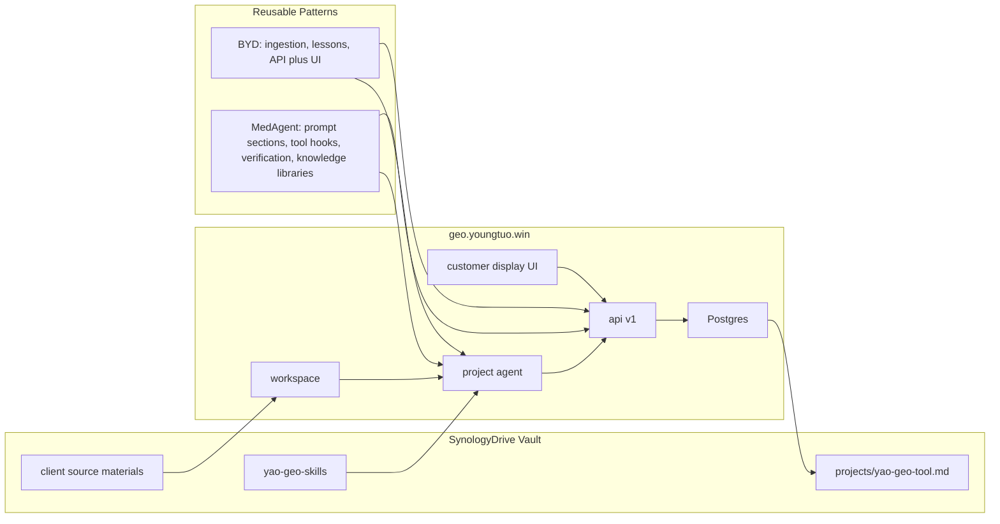

# geo.youngtuo.win Cross-Project Architecture Notes

Date: 2026-05-27

This note records reusable architecture from the SynologyDrive project set, with
focus on BYD Aftersales Agent and MedAgent OS. The goal is to make
geo.youngtuo.win more useful as a Doubao-first GEO workbench without copying
unneeded project-specific complexity.

## What GEOFlow Already Has

- Next.js customer-facing site and `/workspace` workbench.
- Protected write APIs with `ADMIN_CONTROL_KEY`.
- Workspace data model for sources, brand facts, question sets, answer samples,
  reports, social accounts, analytics configuration, and content assets.
- Pi-style agent runtime with planner, tool registry, permission checks,
  confirmation, event timeline, append-only session tree, branching, compaction,
  and context consumption.
- Initial source processor for public URLs and HTML summary extraction.
- Cron-protected monitor endpoint for Day 7/14/30 effect tracking.

## BYD Patterns To Reuse

BYD is closest to a practical technical-support agent. The useful pieces are:

1. Repo and corpus separation.
   - BYD keeps code outside the vault and source materials in the vault.
   - GEOFlow should keep the app code in this repo, but treat client materials
     as workspace-level source assets with clear provenance and processing
     state.

2. Narrow first slice.
   - BYD narrowed the MVP to Barbados K8RA before widening.
   - GEOFlow should onboard one client/domain at a time, with one Doubao
     baseline question bank and one report cycle before broad multi-tenant work.

3. Document-type routing.
   - BYD routes CAN, manual, BOM, diagnostic, and image assets differently.
   - GEOFlow should add source `kind` and retrieval scopes such as `brand`,
     `proof`, `faq`, `competitor`, `case`, `social`, `analytics`, and `policy`.

4. API plus web surface.
   - BYD exposes FastAPI endpoints while keeping visible API URL/token controls
     in the UI.
   - GEOFlow should add a first-class external API page and token model instead
     of hiding integrations behind browser-only forms.

5. Lesson discipline.
   - BYD only writes lessons after explicit outcome feedback, then reuses
     verified lessons differently from unverified ones.
   - GEOFlow should add a "GEO lesson" layer: when a content/report action
     improves Doubao visibility, confirm the result and store the tactic with
     verification status.

6. Stable public delivery.
   - BYD moved from quick tunnels to named Cloudflare tunnel plus launchd.
   - GEOFlow is already on the stable `geo.youngtuo.win` route; document this
     as the default sharing path and avoid ad-hoc demo URLs.

## MedAgent Patterns To Reuse

MedAgent is closest to a governed multi-agent SaaS. The useful pieces are:

1. Dynamic prompt sections.
   - MedAgent assembles prompt sections by priority: role, global rules,
     persona, red lines, profile, session context, active skills, knowledge.
   - GEOFlow should replace the current mostly fixed reply summary with
     sectioned prompt context for domain, brand facts, active GEO skills,
     current report cycle, and permission mode.

2. Tool pipeline with hooks.
   - MedAgent runs PreToolUse, permission checks, execution, and PostToolUse.
   - GEOFlow already has permission checks; next step is adding reusable
     pre/post hooks, especially for publish/report actions.

3. Verification agent.
   - MedAgent gates consultation output through a verification agent.
   - GEOFlow should add a lightweight verification pass for customer-visible
     reports and publishable content: check citations, overclaims, stale facts,
     and missing source links before export/publish.

4. Knowledge libraries and marketplace.
   - MedAgent separates libraries, items, marketplace subscribe/fork, Q&A, and
     brain imports.
   - GEOFlow can start smaller: source libraries per workspace, saved question
     packs, reusable content templates, and later a shared GEO tactic library.

5. Citation chips and evidence modal.
   - MedAgent stores citations back on AI replies and exposes clickable evidence.
   - GEOFlow reports should carry `evidenceUrl`, source snippets, and answer
     sample references all the way into report pages and downloads.

6. Live endpoints stay network-live.
   - MedAgent/PWA practice keeps `/api/*` and `/ws/*` live while caching shell
     assets only.
   - If GEOFlow becomes installable, cache only shell/assets and keep agent,
     monitor, publish, and cron endpoints network-live.

## Skill Strategy

Use the existing `yao-geo-skills` repo as public reusable skill inventory, and
add project-local skills only where they need private GEOFlow operations.

Candidate local skills:

- `geo-client-onboarding`: domain, social accounts, analytics, source inventory,
  Doubao baseline, and first report checklist.
- `geo-source-ingestion`: classify source assets, parse HTML/PDF/text, extract
  brand facts, attach evidence, and queue review.
- `geo-doubao-monitor`: run baseline/day-7/day-14/day-30 samples, detect deltas,
  and generate report.
- `geo-content-gap-writer`: turn low-visibility questions into FAQ/comparison/
  case/social drafts with required evidence links.
- `geo-lesson-memory`: confirm whether a tactic improved Doubao visibility and
  save verified/unverified lessons.
- `geo-report-verifier`: review customer-facing report or publish draft before
  export.

## API Strategy

Short-term endpoints to add:

- `POST /api/v1/sources` and `POST /api/v1/sources/:id/process`
- `GET /api/v1/reports` and `GET /api/v1/reports/:slug`
- `POST /api/v1/monitor/run`
- `POST /api/v1/content/drafts`
- `GET /api/v1/agent/sessions/:id`

Access model:

- Keep `ADMIN_CONTROL_KEY` for browser workspace operations.
- Add workspace-scoped API tokens for external clients, cron, and future
  enterprise integrations.
- Token scopes should map to agent tool permissions: `read`, `source:write`,
  `monitor:run`, `content:write`, `report:write`, `publish:write`.

## Recommended Implementation Order

1. Add source type/routing fields and PDF parser.
2. Add evidence-first report/content verification.
3. Add external API token model and API docs page.
4. Add GEO lesson memory.
5. Add prompt-section assembler for the agent.
6. Package the six local GEOFlow skills after the above behavior exists.

## Mermaid Map

