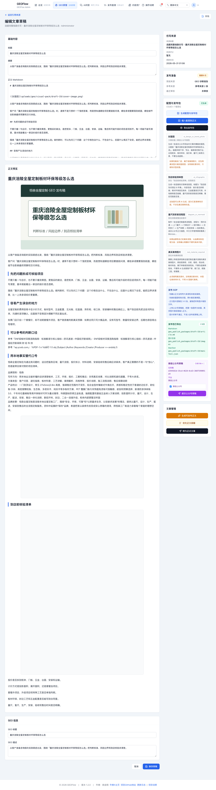

# 2026-05-31 GEOAmplify CLI 与 GUI 验收说明

本次提交把 GEOAmplify 工程整理成可被外部程序调用的统一 CLI，并补齐正式链路在 GUI 中的可见状态。

## 本次新增能力

- 新增统一机器调用入口：`php artisan geoamplify:cli <action> --json='{}' --pretty`
- 新增短包装脚本：`bin/geoamplify-cli`
- 支持 `status`、`schema`、`diagnosis`、`topic-pipeline`、`submit-wxmp-draft`、`web-workbench-status`
- 所有 action 默认输出 JSON，外部程序只需要判断 `ok`、`action`、`error` 和业务字段
- `submit-wxmp-draft` 仍保持公众号草稿安全边界：`pubType=0`、`notifySubscribers=0`
- 修复正式运行中暴露的 UTF-8 截断问题，避免 `GeoWritingTask.brief` 在含中文共享词时 JSON 保存失败

## GUI 截图

下图是正式链路跑完后的后台草稿编辑页，能看到正文预览、发布包状态，以及微信公众号草稿已提交蚁小二。



## 外部程序调用示例

探活：

```bash
bin/geoamplify-cli status --pretty
```

查看契约：

```bash
bin/geoamplify-cli schema --pretty
```

从选题生成草稿和发布包：

```bash
bin/geoamplify-cli topic-pipeline --admin=admin --json='{
  "topic": "重庆涪陵全屋定制板材环保等级怎么选",
  "platform_codes": ["ai_web_workbench:chatgpt", "ai_web_workbench:yuanbao"],
  "max_references": 2
}' --pretty
```

提交微信公众号草稿：

```bash
bin/geoamplify-cli submit-wxmp-draft --json='{
  "draft_id": 19,
  "platform_codes": ["weixingongzhonghao"]
}' --pretty
```

## 验证记录

- `vendor/bin/pint app/Console/Commands/GeoFlowCliCommand.php tests/Feature/GeoUnifiedCliTest.php`
- `php artisan test tests/Feature/GeoUnifiedCliTest.php tests/Feature/GeoOneShotCliTest.php tests/Feature/AdminGeoOpportunityWorkflowTest.php --filter='(unified_cli|cli_|topic_pipeline)'`
- `bin/geoamplify-cli status --pretty`
- `bin/geoamplify-cli schema --pretty`
- `php artisan list geoamplify`
- `php -l app/Console/Commands/GeoFlowCliCommand.php`
- `git diff --check`
- `npm run build`
- `php artisan test`

## 关键文件

- `app/Console/Commands/GeoFlowCliCommand.php`
- `bin/geoamplify-cli`
- `docs/geo/cli-integration.md`
- `tests/Feature/GeoUnifiedCliTest.php`
- `docs/geo/screenshots/geoamplify-cli-gui-draft-19.png`
