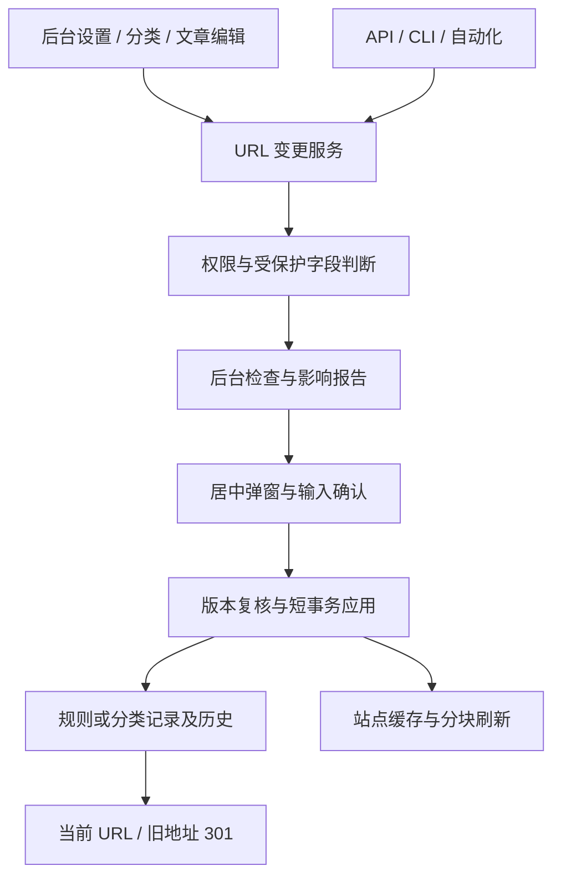

# GEOFlow URL 变更风险管控：最终迭代方案

日期：2026-09-13

状态：待维护者确认后实施

评审基线：本地 `9711d067` 及当前工作区中已迭代的固定链接实现。本文只新增方案文档。

关联方案：[文章固定链接规则原方案](2026-09-12-article-permalink-rules-final-plan.md)

## 1. 推荐方向与本轮修订

将文章规则、分类 URL 标识和存量文章的 URL 元数据变更纳入同一套风险管控：**超级管理员授权 → 检查影响 → 居中弹窗确认 → 服务端校验 → 短事务生效 → 可追踪的后续刷新**。

URL 稳定性作为默认行为。分类显示名称、描述、排序以及文章标题和正文的正常编辑保持原有权限。实际改变地址的操作单独处理。

本轮评审对上一版方案作出以下修订：

| 上一版的缺口 | 最终处理 |
| --- | --- |
| 只覆盖站点规则启用 | 补齐分类 slug、存量文章切换分类及现有 API 显式修改文章 slug 的入口 |
| “受保护文章”定义依赖当前可访问文章 | 将关联文章、当前公开文章、回收站文章、发生地址变化的文章分别统计；权限和确认要求独立于这些数量 |
| 分类改名容易被理解为中文名称变更 | 界面明确区分“分类显示名称”和“URL 标识（slug）” |
| 缺少旧分类页处理 | 增加分类 slug 历史与占用保护，旧分类页一次 301 到当前分类页 |
| 只考虑后台按钮 | 后台、API、CLI 和自动化调用统一经过服务层；非交互入口不能直接修改受保护字段 |
| 弹窗数量可能被误解为访问量 | 明确展示公开地址数、已同步分发记录数；访问量和搜索引擎收录状态不从文章数量推断 |
| 启用时重新全量扫描仍可能超时 | 大范围检查和复核移入可续跑后台任务，最终写事务只校验版本并切换设置 |
| 分类改变后规则 revision 不变 | 增加 URL 数据版本，分类变更也能让旧预览、缓存和过期刷新任务失效 |
| “可以回退代码”容易被理解为 URL 迁移可瞬间撤销 | 分开说明代码回退、业务切回、浏览器重定向缓存和搜索引擎重新处理的限制 |

最小可选方案是在两个保存按钮前增加通用确认框。该方案不能覆盖 API 绕过、分类页旧链接失效和大数据量超时，因此推荐实施本文的完整流程。

## 2. 当前代码证据

以下为本轮源码核对结果，不代表本文功能已经实施：

| 位置 | 当前行为及风险 |
| --- | --- |
| `routes/web.php`、`Admin/ArticlePermalinkController.php` | 主站规则预览和启用已经限制超级管理员，已有 15 分钟加密预览凭据与 revision 校验；缺少输入式风险确认 |
| `Admin/CategoryController.php::update` | 分类名称与 slug 同表单保存；清空 slug 会按名称重新生成，冲突会自动加后缀，管理员可能没有意识到最终地址发生变化 |
| `GeoFlow/MaterialLibraryService.php::updateCategory` | API 分类更新也会重新计算 slug，存在第二条写入路径 |
| `Site/CategoryController.php::show` | 只按当前 slug 查询，分类改为新 slug 后，旧 `/category/{slug}` 没有历史回查 |
| `Site/ArticlePermalinkService.php` | 文章通过 ID 或当前/历史文章 slug 定位，可将旧分类段导向当前文章地址；分类页自身需要另行兼容 |
| `GeoFlow/ArticleGeoFlowService.php::updateArticle` | API 可以显式修改文章 slug 和 category_id；只保护站点规则不能覆盖这些变化 |
| `Admin/ArticleController.php` | 后台文章编辑保持 slug，但切换分类仍可能改变含 `{category}` 的文章地址 |
| `Models/Category.php` | 分类记录没有 `updated_at`，不能直接依赖更新时间完成并发版本判断；分类数据由多个站点共用 |
| `Jobs/RefreshHostedSitePermalinkUrls.php` | 已按 200 条分块，但过期判断只依据规则 revision；分类改变时也需要触发和校验版本 |
| `Site/ArticlePermalinkService.php::inspectArticles` | 仍保留全量文章 ID 和 slug 所有权集合；固定首段优化能降低常见计算量，大量动态首段规则仍会放大匹配成本 |
| `RecordSiteViewLog.php` | 日志有文章 ID、站点、路径、状态码；缺少可靠的全网调用/收录信息，日志采集与保存也可能不完整 |
| `ArticlePermalinkService.php::countStructuredLegacyLinks` | 当前返回命中的设置记录数，文案应称“配置项”，不能直接称为链接条数 |
| `resources/js/admin/action-dialog.js` 与配套组件 | 已有原生 dialog、居中样式、焦点返回和取消操作，可在其上扩展风险内容 |

另外，PostgreSQL 基线迁移中分类 slug 为 `VARCHAR(100)`，现有表单允许 255 字符。新写入规则应统一到 100 个 ASCII 字符，并用实际数据库结构与兼容测试验证，避免仅在 SQLite 测试成功。

## 3. 范围与权限决策

### 3.1 操作矩阵

| 操作 | 权限和确认 | 地址影响 |
| --- | --- | --- |
| 修改分类显示名称、描述、排序 | 维持现有编辑权限，正常保存 | slug 原值保留，URL 不变 |
| 新建分类并首次设置 slug | 维持创建权限，执行格式/占用/保留入口校验 | 首次建立地址，正常保存 |
| 修改已创建分类的 slug | 仅超级管理员，检查与输入式确认 | 分类页地址变化；文章地址按站点模板计算 |
| 修改主站或托管站文章规则 | 仅超级管理员，检查与输入式确认 | 作用于目标站点现有和后续文章 |
| 规则内容完全相同 | 返回“规则未变化”，无确认和版本递增 | 无变化 |
| 编辑文章标题、正文 | 维持现有内容权限 | 保持文章 slug |
| 将存量文章切换分类，且会改变任一受管理站点的当前文章地址 | 仅超级管理员，在已有文章编辑流程内展示前后 URL 并确认 | 通常每个受影响站点一条当前地址 |
| 切换分类且所有受管理站点的当前文章地址均不变 | 维持现有文章编辑权限 | 正常保存；预览的数据版本按实际关联变化更新 |
| 显式修改存量文章 slug | 服务端纳入保护；现有非交互 API 本期拒绝直接变更 | 包含永久兼容入口和当前/历史文章地址的影响 |

关键调整：**对已建立的规则和分类 slug，确认要求不以“当前文章数是否大于零”作为开关。** 即使分类暂时没有文章，也可能已有分类页书签、外链或历史使用记录。文章数用于说明影响范围，不能用作免确认凭据。站点规则切换统一使用输入式确认，新建分类的首次命名保持正常创建流程。

不新增单篇文章完整 URL 编辑器。后台当前没有显式文章 slug 编辑表单，本期不增加该入口；先收住既有 API 写路径。

### 3.2 分类字段行为

- “分类显示名称”：示例“行业动态”，用于导航、标题和展示。
- “URL 标识（slug）”：示例 `industry-news`，用于 `/category/industry-news`；在 `/{category}/{slug}` 规则下，也用于 `/industry-news/article-slug`。
- 编辑时默认只读展示当前 URL 标识，超级管理员通过“修改 URL 标识”展开编辑。
- 普通管理员可以正常保存显示名称、描述和排序；篡改请求中的 slug 由后端拒绝。
- 编辑请求省略 slug 时保留原值；显式传空值返回字段错误，不重新生成。
- 新增时允许省略 slug 并由系统生成；自动生成可以寻找未占用后缀。显式填写的冲突值返回错误及建议值，不静默替换。
- 编辑后的 slug 采用小写英文字母、数字与短横线，单段、1～100 个字符。预览展示经过规范化后的实际保存值，确认凭据绑定这个值。
- 既有不符合新格式的 slug 保持可读取；只修改分类名称时不强制迁移旧 slug。

日期令牌继续使用不可变的 `created_at`；日常文章编辑和 API 更新不得修改该字段。站点运行时区调整需要单独核对日期型 URL 的变化，纳入运维变更检查，本期不新增时区迁移入口。

分类页继续使用 `/category/{slug}`。本次增加该地址的迁移保护，不新增根级分类页或分类页模板设置。

### 3.3 API、CLI、自动化边界

- 创建新分类、新文章以及修改非 URL 字段继续使用现有权限和接口。
- 对已有分类 slug、文章 slug，以及会改变当前地址的 category_id 修改：普通管理员返回 403；超级管理员的非交互调用返回 409 `url_change_confirmation_required`，引导进入后台处理。
- 不接受单独的 `force=true`、`confirmed=true` 或固定确认字符串作为免预览通行条件。
- API 同时提交正文和受保护字段时，整个请求拒绝，避免出现部分字段已保存的误解。
- CLI 和 AI 工作台通过上述 API/服务进入同一限制，不拥有额外豁免。
- 内部生成任务负责首次建立新文章地址，不能自动改写存量文章 slug。数据库维护脚本属于人工运维边界，不能宣称网页弹窗能约束直接 SQL。

这是本轮有意收紧的接口行为，实施时需要更新 API 契约测试与操作说明。

## 4. 影响报告：数量口径和文章列表

### 4.1 必须展示的指标

| 指标 | 口径 |
| --- | --- |
| 关联文章总数 | 分类下所有现存文章，包含草稿、私有及回收站，按文章 ID 去重 |
| 当前公开文章数 | 使用主站和托管站各自的真实可访问查询条件，按站点分别统计 |
| 本次变更地址的文章数 | 比较同一文章、同一站点下的新旧规范路径；相等的路径不计入 |
| 受影响文章 URL 数 | 按“站点 + 文章”计数；同一文章在多个域名的地址可分别计入 |
| 草稿/私有/回收站数量 | 单列未来发布、恢复时的影响，不能计成当前公开地址 |
| 分类页地址变化 | 列出在当前数据下具备分类页的主站/托管域名及前后路径；潜在未来地址单独说明 |
| 已同步分发记录 | 来自已同步记录，标明渠道与待处理状态；该数量不等于访问次数 |
| 命中旧地址的配置项 | 检查已知结构化设置，说明计数单位为配置项 |

规则检查统计不能只读取 `published` 后得到“站点没有文章”。风险摘要与路由可访问性采用不同、明确的统计口径。

### 4.2 “已经有人调用 URL”如何表达

本期在弹窗中展示可核实的“已公开文章地址”和“已同步分发记录”，用于说明地址已经具备对外传播条件。实际 PV、第三方引用量和搜索引擎收录量不从这些数字推断。

访问情况提供现有数据分析入口；本期不为弹窗新增访问量聚合平台，也不在打开弹窗时扫描全部 `view_logs`。未取得访问证据时统一说明：“外部分享和搜索引擎收录情况无法完整统计，请按已对外使用的地址处理。”

### 4.3 哪些文章受到影响

- 弹窗只显示最多 3 篇文章示例，包含标题、站点、旧 URL、新 URL。
- “查看受影响文章”打开可返回原流程的报告页，按主键游标分页，每页 20 条；支持站点筛选。
- 完整清单在后台生成，内容来源于被确认的报告快照，不把几十万条记录放入 HTML、session 或凭据。
- 本次迁移清单明确区分“本次旧规范地址”和“历史规则推导地址”。推导地址不标注为曾经被访问的真实历史。
- 报告注明生成时间及对应版本。列表/下载时版本过期需要重新检查，不能混用当前数据和旧统计。

## 5. 分类变更的跨站点影响

分类是共享数据。修改同一分类 slug 时，影响报告必须覆盖主站和使用该分类文章的所有第一方托管站。

例如 `ai-news` 修改为 `industry-news`：

| 站点当前规则 | 分类页 | 文章页 |
| --- | --- | --- |
| `/article/{slug}` | `/category/ai-news` 变为 `/category/industry-news` | 当前文章地址不变 |
| `/{category}/{slug}` | 分类页同上 | `/ai-news/example` 变为 `/industry-news/example` |
| `/article/{id}.html` | 分类页同上 | 当前文章地址不变 |
| 当前规则不含分类、历史规则包含分类 | 分类页同上 | 当前规范地址不变；历史文章入口兼容仍需保留 |

分类字段变更确认针对全部受影响的主站/托管站统一执行，不提供“只改一个域名”的选项，因为它们共享同一分类记录。

独立 GEOFlow Agent 站点保存分发内容的副本。报告列出已同步该分类文章的 Agent 渠道并标记“需要另行同步”；本期本地分类修改不自动向远端发布或改写远端 URL。后续显式同步沿用现有渠道确认、能力检查和静态原子构建流程。WordPress 与 Generic HTTP API 保留远端返回的 URL，不根据本地分类推算替换。

## 6. 页面与居中弹窗设计

视觉沿用后台现有浅色表面、系统字体、16px 弹窗圆角、8px 按钮圆角和半透明遮罩。风险采用琥珀色图标与简短说明，正文保持深色。已有通用对话框的 480px 宽度适合短消息，本次增加局部的 640px 风险内容变体，其他对话框宽度保持现状。

### 6.1 页面行为

1. 当前规则/URL 标识优先显示为稳定状态，并提示“地址建立后建议长期保持稳定”。
2. 修改内容后点击“检查影响”，期间显示检查进度。
3. 检查完成后显示新旧地址与摘要，按钮为“查看风险并确认”。检查通过文案补充“表示格式和冲突检查通过”。
4. 点击后在浏览器视口正中间打开一个模态弹窗。
5. 输入指定确认语，按最终按钮提交。修改模板、分类 slug 或目标分类后，旧确认状态立即失效。
6. 取消返回原编辑页，保留尚未提交的内容；权限校验和高风险操作失败时，不部分保存同一表单中的其他字段。

### 6.2 分类 URL 标识弹窗文案

以下数字和文章路径为排版示例，不代表当前数据库数据。

> **修改分类 URL 标识**
>
> 分类：行业动态
>
> URL 标识：`ai-news` → `industry-news`
>
> 该分类关联 120,000 篇文章，其中 96,000 篇当前可公开访问。
>
> 本次预计改变主站及 2 个托管站上的 96,000 个文章地址。完整影响范围以本次检查报告为准。
>
> 分类页：`/category/ai-news` → `/category/industry-news`
>
> 文章示例：`/ai-news/example` → `/industry-news/example`
>
> 旧分类页和旧文章地址将通过 301 跳转到对应的新地址。搜索引擎需要重新处理这些地址，收录和排名可能暂时波动；外部链接、浏览器缓存及远端内容副本也需要关注。
>
> 建议先下载迁移清单，并在访问低峰期修改。后续请尽量保持 URL 标识稳定。
>
> 请输入 **确认修改分类链接** 后继续。

若受影响文章地址数为 0，则替换为：“本次会修改分类页地址。当前文章规则不包含分类标识，现有文章详情页地址保持原值。”

若分类为空，替换为：“该分类当前没有关联文章。旧分类地址可能已经被保存或分享，仍将保留历史标识保护。”

按钮：`取消，保持原地址`、`确认修改分类链接`。

### 6.3 文章规则弹窗文案

> **确认修改文章链接规则？**
>
> 作用站点：主站
>
> 当前规则：`/article/{slug}`
>
> 新规则：`/{category}/{slug}`
>
> 本次预计改变 96,000 篇公开文章的地址；草稿、私有及回收站文章在后续发布或恢复时也会采用新规则。
>
> 系统将保留旧文章入口，更新受管理页面的规范地址和内部链接。搜索引擎收录、排名和访问统计可能在迁移期间波动。301 跳转可以维持旧入口的可达性，迁移影响仍需要观察。
>
> 请输入 **确认修改文章链接** 后继续。

按钮：`取消，保持当前规则`、`确认启用新规则`。空站使用“当前没有文章，此规则将用于后续新增文章”的对应文案，同样明确确认目标规则。

### 6.4 交互与无障碍

- 桌面最大宽度 640px，窄屏保留左右各 16px；最大高度为视口减 32px，内容区滚动，按钮区可见。
- 规则和 slug 用等宽文字，长 URL 可换行；摘要不截断影响数量，文章标题在详细报告中可完整查看。
- 最终按钮在确认语不匹配时禁用。确认语按报告绑定的语言选择中文或英文固定值，前后空白可去除，内部文字须一致；切换语言需要重新打开确认，不依赖服务端当前 locale 猜测。
- 英文确认语分别为 `CHANGE CATEGORY URL`、`CHANGE ARTICLE URLS`；提示和按钮完整本地化。
- 打开后焦点位于标题/风险摘要，按 Tab 进入下载、输入和取消/确认操作；绝不默认聚焦最终确认按钮。
- Esc、遮罩和取消均安全退出；再次打开清空确认语。输入框 Enter 不执行最终危险提交，允许用户聚焦最终按钮后用键盘激活。
- 提交中禁用重复操作，显示“正在应用”；响应丢失后通过变更记录查询实际状态，避免重复变更。
- JS 加载失败时不能提交受保护操作，给出“确认组件未加载，请刷新后重试”。
- 使用原生 `dialog` 和有标题、描述的语义。丰富表格/列表采用普通模态 dialog，简短风险消息使用 alertdialog，避免读屏一次性朗读整份报告。
- 指针触发沿用 180ms 的轻量透明度/位移动效；键盘及减少动效偏好关闭入场动画。

交互遵循 [W3C 模态对话框模式](https://www.w3.org/WAI/ARIA/apg/patterns/dialog-modal/) 的焦点管理、关闭和键盘约定。

## 7. 服务端确认与并发一致性

### 7.1 确认凭据

沿用现有 Laravel 加密能力，增加持久化变更记录。凭据绑定管理员 ID、认证版本、站点/分类/文章目标、操作类型、原值、规范化后的新值、报告摘要哈希、数据版本、随机 nonce 与过期时间。

- 检查成功后产生待确认记录，确认有效期从报告完成时起计算 15 分钟。
- 后端重新检查管理员处于启用状态且仍是超级管理员；权限降低后旧凭据失效。
- 最终确认语由后端校验，但确认语本身不承担身份认证功能。
- 成功生效后记录凭据已消费；重复请求读取原结果，不再次增加版本或追加历史。
- 旧值、模板 revision、分类 URL 版本、数据版本或目标站点状态不符时，拒绝应用并要求刷新报告。
- 不把凭据、确认语、完整文章列表、文章正文写入审计日志。

### 7.2 数据版本与预览过期

新增按 `primary`、`hosted:{id}`、`category:{id}` 保存的 URL 数据版本。当前规则版本继续沿用既有 revision，两者分别表达规则变化和地址相关数据变化。

文章新增、slug/category_id 变化、发布/撤回、软删除/恢复、托管分配，以及相关分类/规则变化，都在原业务事务中推进受影响范围的数据版本。普通正文、标题、阅读量更新不推进 URL 数据版本，除非该操作同时改变可访问状态。

检查任务开始与结束核对版本，防止两次分页扫描拼出不同时间的数据。最终应用事务锁定对应范围版本行、目标记录和待确认记录，再次核对版本后保存。

并发写入与最终应用遵守统一锁顺序：范围版本行按确定顺序、目标资源行、slug 占用锁、变更记录。实现时调整现有文章/分类写入入口的加锁顺序，禁止只追加一个锁造成锁顺序反转。新分类取名也参与同一 slug 命名空间保护。

检查期间允许正常访问与内容生产。相关 URL 数据不断变化会使报告过期，这是明确的安全失败状态；系统保留原地址，并提供重新检查。连续两次出现这种情况时，提示在发布低峰期检查，或由管理员主动暂停相关发布/导入任务后重试。系统不自动暂停任务，也不自动放行旧报告。

该选择优先控制低频 URL 迁移的成本，不引入增量日志重放和长时间数据冻结平台。需要持续高频发布且同时实时迁移的场景，超出本次保证范围。

## 8. 分类历史、唯一性与旧地址

新增 `category_slug_histories`，保存原 slug、分类 ID、原分类 ID、创建/最近使用时间以及操作管理员引用。slug 建唯一索引，分类 ID 建索引。

- 历史 slug 继续由原分类占用，其他分类不能复用。
- 同一分类允许切回自己的旧 slug，并保存刚被替换的 slug。
- 当前 slug 与历史 slug 的跨表占用检查由统一 `CategorySlugRegistry` 在事务与有序命名空间锁内完成；保留当前表及历史表各自的唯一约束。
- 所有生产分类创建/改 slug/删除路径统一接入，后台和素材 API 不再分别维护生成算法。
- 分类本身删掉时，历史记录保留为空目标墓碑，并把删除前的当前 slug 纳入占用；旧地址返回 404，不能被新建分类接管。继续保留现有“有关联文章或任务不得删除”限制。
- 迁移只能保存升级后的真实变化，不臆造升级前缺失的旧 slug。
- 升级前已有冲突数据列入报告并阻断对应变更，不能悄悄修改既有地址。

前台分类页先检查当前 slug，再检查历史映射；找到分类后，仍使用当前请求站点的文章可见性条件。

旧 `/category/ai-news?page=2` 可直接 301 到 `/category/industry-news?page=2`。连续改名 A → B → C 后，A 与 B 都根据分类 ID 生成 C 的当前规范地址。查询参数保留，非法编码或不安全目标拒绝。目标分类在该托管站不可见时保持 404，避免暴露其他站点内容。

文章旧分类段继续通过文章 ID/slug 定位并生成最新规范地址，不在每次请求中扫描分类文章，也不为每个历史分类和文章生成永久路径笛卡尔积。

对当前和历史规则共同执行系统保留入口检查，覆盖自定义后台前缀、`admin`、`api`、`_boost` 等实际保留入口。必须把“当前地址无冲突”和“旧规则仍可解析”同时纳入检查。

## 9. 大数据量处理

### 9.1 现有测试结论的边界

上一轮记录的 10 万篇约 13.3 秒、30 万篇约 40 秒，来自本地合成文章模型与 10 条历史规则的规则引擎测试。该数据作为开发参考，不能等同于真实 PostgreSQL、几十万条分发记录和完整网页请求的容量保证。本轮方案评审没有重新运行这些压力测试。

现有优化减少了全路径缓存，但文章 ID/slug 所有权集合仍随文章总量增长。匹配成本也不能笼统视作线性：在多条动态首段规则相互重叠时，最坏工作量会接近 `文章数 × 每篇历史 slug 数 × 规则数²`。测试需要覆盖这种分布。

### 9.2 选定实现

1. 所有批量规则和分类 URL 检查使用持久化后台检查任务。HTTP 只创建/读取检查任务；单篇文章地址变更只做定向检查。
2. 初始每批读取 500 个资源，按主键游标推进；生成路径和所有权候选分批处理，每批最多 500 个定位键。
3. 所有权校验改为按候选 ID/slug 批量查询有索引的当前表和历史表，使用目标站点可见性条件，不保存全站文章所有权 PHP 数组。
4. 检查分类变更时只遍历该分类的目标文章；碰撞候选需要查询目标站点全范围，以发现与其他分类文章的冲突。
5. 历史 slug 极多时按 `(article_id, history_id, pattern_index)` 记录检查位置，不能在单个文章的巨大历史集合中无期限运行。
6. 单任务分段工作目标不超过 15 秒，任务 timeout 固定 60 秒，3 次重试，瞬时故障退避 5/15/30 秒；worker 与连接的保留时间必须留足余量。达到资源预算时保存游标并排后续段。
7. 每个作用范围最多一个执行中的 URL 检查/刷新，同范围重复请求返回现有任务；不同草稿可保存，但进入任务前重新检查版本。分类变更与相交站点的规则切换不能并行应用。
8. 任务的进度、游标和下一段待执行状态持久化；复用调度器每分钟恢复已提交但未入队、超时失联的待执行段。幂等键使用变更 ID、阶段、游标，补发不会重复生效。
9. 最终确认后复核权限、凭据和所有相关版本；版本一致时复用已完成的冲突检查报告，在短事务中锁定相关版本及命名空间后切换，无需再跑一遍全量检查。版本失效则要求重新检查；权限失效则拒绝操作。事务中不全量扫描、不生成 CSV、不调用远端。
10. 长时间无进度、队列停止或存储不足时给出明确状态，保留原规则/分类 slug，不把“已提交后台”显示为“已修改成功”。

Laravel 的分批读取及任务幂等机制作为实现基础，具体语法以项目版本为准：[查询分批处理](https://laravel.com/docs/12.x/queries#chunking-results)、[队列与唯一任务](https://laravel.com/docs/12.x/queues#unique-jobs)。

### 9.3 刷新、索引与存储

- 分类 slug 更新只写分类及历史，不批量重写文章正文、slug 或 category_id。
- 页面 URL 在读取时使用当前分类与策略生成；共享分类变化推进相关域名的 URL 版本与设置缓存版本。
- 托管分发记录继续每批 200 条刷新，增加类别/文章筛选，以及规则版本和 URL 数据版本双重校验。
- 刷新任务只读取 ID、slug、category_id、created_at 和必要分类字段，禁止通过完整 article 关联加载正文。
- 保存分发结果前在短事务中核对相关版本，阻止旧任务覆盖新结果；按游标、目标版本幂等执行。文章从其他分类迁入时通过对应文章事件安排定向刷新。
- 检查并补齐 `articles(category_id,id)` 等实际所需复合索引；用真实 PostgreSQL 的查询计划验证，避免重复索引。索引创建按升级计划安排维护窗口。
- Sitemap 保留分片，响应改为分批流式输出；大规模页边界清单按站点、URL 数据版本和规则 revision 隔离，使用主键边界避免深 OFFSET 扫描。新清单在后台生成完成后原子切换，生成期间保留上一份可用清单；旧 URL 通过兼容跳转继续访问。清单切换纳入刷新完成条件，避免每次请求重建全量边界。
- Sitemap 中文章 `lastmod` 取内容更新时间与相关规则/分类 URL 变更时间的较新值，无需批量更新几十万行文章时间戳。
- CSV 按旧规范地址流式写入私有临时文件；超过 100,000 行自动拆分清单。中间文件不可被公共静态服务器直接访问。
- 每次变更临时文件总上限 2 GiB，生成前与每批检查至少剩余 1 GiB 可用空间；不足时停止导出并提示。部分文件明确标记未完成，不作为完整迁移清单。
- 任务结束后，报告与临时清单保留 24 小时。清理只处理已结束且过期的变更目录，跳过仍在执行或被有效任务引用的文件；审计摘要和历史规则/slug 映射持续保留。日志、session、凭据均只携带摘要。
- 清单导出与冲突检查分离，导出资源不足不会绕过检查，也不将不完整导出标记为完成。

### 9.4 生产风险与处理

| 风险 | 防范及失败结果 |
| --- | --- |
| 管理请求超时 | 批量检查后台化，前台读取状态，已有规则继续服务 |
| 内存随文章/历史数量增长 | 分批读取、批量索引定位、历史游标；禁止全量数组与正文加载 |
| 后台扫描抢占业务资源 | 同范围串行、短任务、低优先级作业；压力测试量化前台延迟 |
| 修改时新增文章/迁移分类 | URL 数据版本与最终事务校验；变更过期须重新确认 |
| 数据库长锁/死锁 | 固定锁顺序、短事务、冲突回退；禁止事务内扫描或远端调用 |
| 新地址撞到其他分类文章/历史地址 | 跨目标站点范围的所有权校验；碰撞信息列明文章与路径 |
| 旧地址被复用 | 分类历史占用与删除墓碑，文章沿用既有 slug 历史保护 |
| 刷新任务重试/重复投递/旧版本晚到 | 游标幂等、版本核对、持久任务状态与恢复调度 |
| 搜索引擎重新抓取增加负载 | 迁移清单、低峰操作、Sitemap 分片、观察现有访问和错误指标 |
| 规则历史过多 | 展示历史规则数量和预计处理时间，达到 10 条显示性能提示；保持历史兼容，不自动删除 |
| 外部缓存保留旧重定向 | 明示缓存生效时间，业务切回前检查曾发出的缓存时长，避免快速往返切换 |

Google 官方说明 URL 迁移期间可能发生排名波动，并且抓取负载可能暂时增加。迁移方案保留逐地址永久跳转、更新规范地址与 Sitemap，并建议低峰执行。[Google URL 迁移说明](https://developers.google.com/search/docs/crawling-indexing/site-move-with-url-changes)

## 10. 数据结构与实现边界

本次采用一个完整发布批次，按内部步骤完成实现。后台按钮、服务端守卫、历史跳转和大数据量检查同时验收。预计涉及 20 个以上文件和多个明确的领域组件，规模已超出上一版仅增加弹窗的改动。

新增三项数据结构：

| 结构 | 必要字段/约束 | 用途 |
| --- | --- | --- |
| `category_slug_histories` | 全局唯一 slug、可空 category_id、original_category_id、时间及操作者；category_id 索引 | 旧分类页定位、唯一占用与删除墓碑 |
| `url_change_requests` | UUID、操作类型、目标及作用范围、管理员及认证版本、旧/新值、版本摘要、nonce 哈希、状态、游标、统计摘要、文件引用、确认及失效时间、错误摘要 | 报告、二次确认、幂等应用、刷新进度与恢复 |
| `url_change_scope_states` | 唯一 scope_key、单调递增 data_revision、URL 最近变更时间、正在执行的变更引用 | 预览过期、相交变更互斥、刷新版本与缓存失效 |

`url_change_requests` 状态固定为：`checking`、`ready`、`applying`、`applied`、`refreshing`、`completed`、`stale`、`failed`、`cancelled`。`applied` 表示本地地址已生效；`completed` 表示本文承诺的本地/托管刷新也已完成。独立远端站的“另行同步”单列显示，不混入本地完成状态。

字段中不保存文章正文或完整文章 JSON。预览详情使用小型摘要与私有流式结果文件。数据库迁移纳入 `deployment/upgrade-plan.json`，兼容 PostgreSQL 和 SQLite。

主要代码落点：

- 复用并修改：`ArticlePermalinkService`、`HostedSitePermalinkService`、两个固定链接控制器、`CategoryController`、`MaterialLibraryService`、`ArticleGeoFlowService`、现有文章编辑/工作流和分发写入服务。
- 新增领域组件：`CategorySlugRegistry` 负责分类标识归属；`UrlChangeService` 负责权限、报告、版本和确认；分段后台任务负责检查、复核和后续执行。路径放在现有 `app/Services/Site`、`app/Services/GeoFlow`、`app/Jobs` 结构中。
- 前台：分类页控制器、统一 URL 生成、Sitemap 输出与既有托管 URL 刷新任务。
- 界面：网站设置、分类编辑、文章编辑、托管站编辑、报告页；复用 `x-admin.action-dialog` 的语义与视觉，增加有作用域的风险内容变体。
- 文案：`lang/zh_CN` 与 `lang/en` 同步；其他语言沿用项目既有回退机制。

接口策略：保留现有固定链接 preview/activate 路由作为兼容入口，内部转到变更流程；新增后台 `url-changes` 的报告查询、状态、取消、确认和下载命名路由。分类/文章编辑的检查请求创建绑定相应资源的变更记录。路由统一使用配置的后台前缀，不硬编码 `/admin`。报告、确认和清单仅超级管理员可用，确认必须绑定原发起管理员。

新增 0 个第三方依赖、0 个 API Key、0 个对用户开放的调参项，复用 Laravel 队列、数据库、加密与调度器。生产需要现有异步队列和调度器正常运行；`sync` 队列不得承担批量检查，页面明确显示运行条件错误。

关系如下：

非交互入口在 D 对受保护修改返回后台确认要求，不能直接到 G。

## 11. 验收计划

### 11.1 行为与安全

1. 普通管理员可修改分类显示名称、描述和排序；无法修改已建立的分类 slug，也无法调用规则预览/启用/报告下载。
2. 标题/分类显示名称编辑不改变 slug；省略 slug 保持原值，显式清空编辑字段返回可操作错误。
3. 无文章、仅草稿、仅回收站、有公开文章、有历史规则、规则相同均有覆盖；确认级别不因清空分类而降低。
4. 主站不含 `{category}`、托管站包含 `{category}` 时，报告正确列出跨站点文章影响。
5. 同一文章和多个分发记录数量可区分，关联文章/公开 URL/同步记录不会混用；未知访问量不显示为零访问。
6. 修改分类 slug、旧分类页、连续改名、切回旧 slug、历史 slug 被其他分类抢占、删除墓碑和保留入口均有覆盖。
7. GET/HEAD 旧地址一次 301、保留查询参数；私有/删除/其他站点不可见资源仍不可访问，301 不增加文章阅读量。
8. 存量文章改 category_id 的前后路径确实变化时触发保护；实际无变化时正常保存；API 直接改受保护字段被拒绝。
9. 确认语缺失/错误、伪造凭据、跨账号/站点复用、降权、过期、重复确认、JS 失效均不能未经验证写入。
10. 预览后新建/发布/恢复文章、变更分类/规则或托管归属时，报告失效；正文和阅读量变化不误伤报告。
11. 分类创建/改名并发争用 slug、分类改名与站点规则变更并发、旧任务晚到写入等场景在 PostgreSQL 下真实执行。
12. 审计记录含范围、前后值、影响摘要、操作者、版本与结果；确认语和凭据不落日志。
13. 后续新建/改文章 slug 的定向冲突检查覆盖当前和历史规则，防止规则启用通过后产生新的跨模板歧义。

### 11.2 大数据量与真实数据库

在独立测试数据库运行，不向用户本地业务库灌入压力数据。至少包含：

| 场景 | 必测内容 |
| --- | --- |
| 10 万文章、1 万篇目标分类、1 条规则 | 分类聚合、最小范围查询和分页明细 |
| 30 万文章、20 万篇集中分类、10 条历史规则 | 高占比分类改名、分段检查与迁移导出 |
| 50 万文章、30 条规则，含动态首段、每篇 5 条历史 slug | 内存和规则交叉匹配最坏分布，不能只测试固定 `/legacy-N/` 前缀 |
| 50 万文章、少量文章各有 1 万条历史 slug | 单个巨大历史集合的游标续跑和内存上限 |
| 多个托管站采用不同规则 | 跨站点影响、去重计数、缓存隔离与分发刷新 |
| 发布写入持续发生 | 预览过期、短事务竞争、安全失败提示及正常浏览可用 |
| Worker 中止/重试、队列断开、文件配额耗尽 | 断点恢复、幂等、防止错误显示已生效 |

记录数据规模、硬件、数据库版本、索引、冷热缓存、耗时、峰值内存和查询计划。既有合成基准继续保留，另外增加真实 PostgreSQL 路径测试。

验收预算：HTTP 发起/状态接口本地 p95 小于 2 秒；单批后台工作目标 15 秒以内；50 万规模单 worker 峰值内存增量不超过 256 MiB；最终应用写事务目标小于 1 秒，禁止随文章数量线性增加。压力期间规范文章页 p95 相较空闲基线增幅目标不超过 20%。这些是待验证的目标值，未实测达标时不能宣称对应容量通过。

### 11.3 UI 与项目检查

- 实际浏览器验证桌面和 375px，补充 320px 按钮长文案；中英文均检查居中、滚动、长 URL、取消和键盘操作。
- 检查通过、检查失败、任务排队、报告过期、应用中、已生效但刷新未完成，分别验证界面状态。
- 执行聚焦 PHP/JS 测试，再按 `.github/workflows/ci.yml` 完成格式、PHP、JavaScript、构建和 PostgreSQL 门禁。
- 命令基线：`composer test`、`npm run test:analytics`、`npm run build`、`vendor/bin/phpunit -c phpunit.postgresql.xml`；压力测试单独调用 `tests/Performance`，不能被默认测试目录排除后误报已执行。
- 核对路由缓存、自定义后台前缀和升级计划生成/校验；审查独立 Agent 契约，确认本地操作没有隐式远端同步。
- 当前工作区存在其他任务改动，实施和验收保留它们；最终评审使用本任务范围的隔离验证证据。

## 12. 升级、失败与回退

实施顺序：统一受保护写入和版本管理 → 分类历史与路由兼容 → 后台检查及确认 → 分块刷新与报告 → UI → 权限/并发/规模验收。所有步骤完成后作为本次迭代交付。

发布先进行新增表/索引迁移和升级计划校验，再发布后端、前端资源并重启相应队列。旧预览凭据在升级后作废并提示重新检查；升级本身不切换文章规则或分类 slug。

- 应用事务提交前失败：保持当前规则和 slug。
- 应用事务已提交、后续刷新失败：显示“地址已生效，刷新未完成”，从失败批次重试；不自动反向切换地址。
- 业务需要切回：使用同一检查和确认流程选择旧值，增加新版本，保留全部历史映射。
- 已生效的分类历史不能随普通代码回退删表或清空，否则旧分类链接会失去定位。允许回退 UI/检查流程，旧地址解析与新历史表必须保留；完整旧版本回退需要专项兼容方案。
- 浏览器或 CDN 曾缓存 A→B 时，立即切回 B→A 可能出现客户端跳转环。切回前检查以前发出的缓存有效期并处理可控缓存；降低新响应缓存时间无法取消已经发出的旧缓存。搜索引擎处理也不会随代码回退立即恢复。

本期不自动改写历史正文链接、不清理历史规则、不操作外部 CDN 或 Search Console、不新增分类合并/多级分类模型、不自动把本地分类变化发布到独立远端站。

## 13. 确认后的完成标准

完成意味着：主站与托管站规则修改、分类 URL 标识修改及相关存量文章写入口都遵守同一授权边界；居中弹窗能展示准确的影响口径和少量示例；服务端可拒绝绕过与过期确认；旧分类页和文章页保持可解释的跳转；真实大数据量和并发测试有结果可核对。

本文件取代上一轮聊天中的风险弹窗方案。此次需要确认的实际范围包含分类历史、共享分类跨站点影响、非交互接口权限收紧，以及大范围检查的后台化。确认后据此实施并复核。
